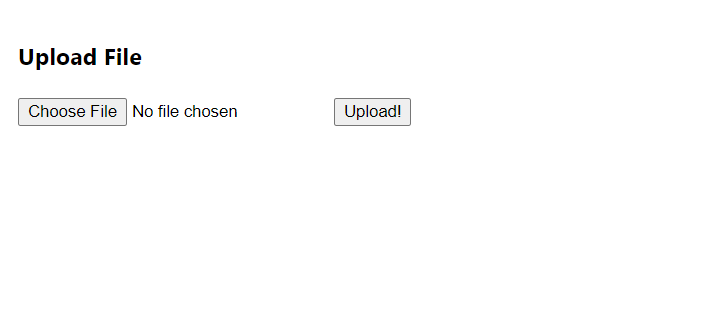

## About Project

Upload file via react and express js.

## Steps to set up DB

1. Download or clone using git clone https://github.com/abstainsolutions/react-crud-node.git
2. Run any local server like wamp or xamp as we need to make DB connection
3. Find react.sql file at root of application
4. Create DB named "react" and import sql

## Steps to set up run node server

DB details can be changed from index.js inside node folder. 

1. Move inside node folder in root directory
2. Install modules via following commands
3. npm i express
4. npm i cors
5. npm i multer
6. npm i body-parser
7. node index.js					// runs node server

## Steps to set up and run react app

1. Move into project main directory run following command
2. npm install
3. npm run dev 
4. Open returned url in preferred browser

## Preview

## Contact

Abstain Solutions - developer.abstain@gmail.com

All Projects : https://github.com/abstainsolutions/

Website : https://www.abstainsolutions.com/